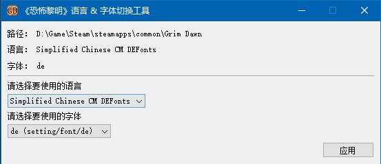

# 《恐怖黎明》语言 &amp; 字体 设置工具

## 功能：
* 支持在不启动游戏的情况下，切换游戏语言（通过修改options.txt实现）。
* 支持修改语言所用字体（会重新打包language.def文件）。

## 使用方法：
* 将 GDConfigure.exe 放入《恐怖黎明》游戏的安装目录即可。

## 源码包使用方法：
* 在 Qt 环境中编译完成后，执行 BoxedAppPacker 工具目录中的 Package.bat 即可完成打包，文件生成在源码根目录中。
